# Fermenation Station

# About the Project

The motivation behind *Fermentation Station* was to have an easy way of maintaining a controlled environment (meaning temperature and humidity). Fermentation is a fickle process and maintaining the desired temperature and humidity in a stable manner is crucial for providing a safe and delicious product. Thus the premise is simple: have a contained system which handles everything you need to worry about. Set a target temperature and humidity value, put your produce in the box and come back in a couple of days to your ferment.

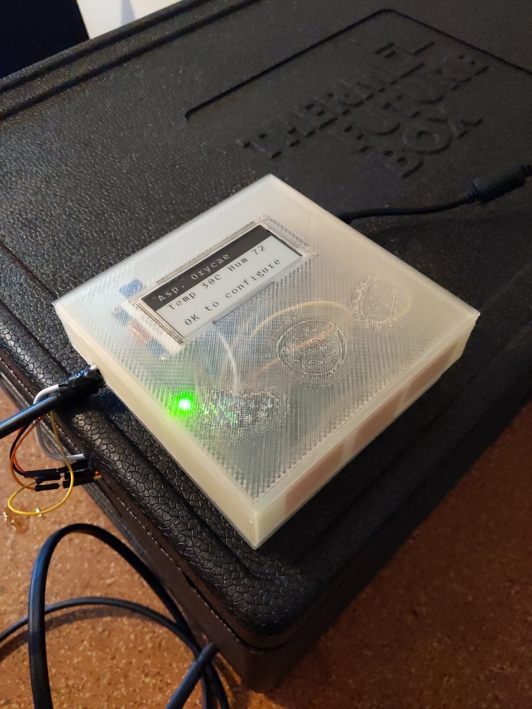

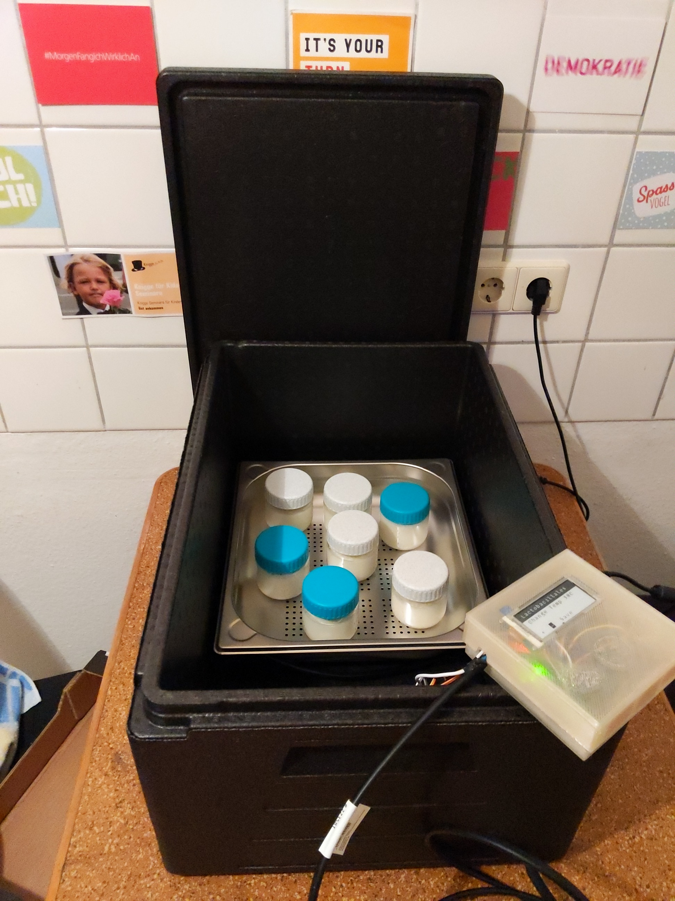

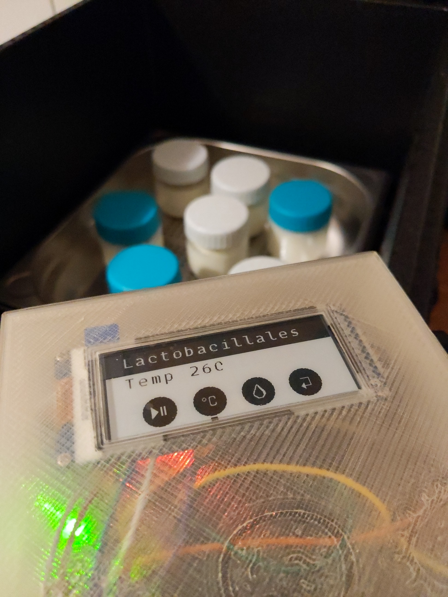

# How to use it

The user has three capacitive buttons to press: a `-`, `+` and `ok` button.

1. Connect the Fermentation Station to a power socket and wait for it to boot
2. On the recipe selection screen, use the `-` and `+` buttons to select a recipe
3. Confirm your selection with the `ok` button
4. If you need to, change the temperature and humidity to your desired values
5. Start the fermentation process
6. Come back in a couple of days and enjoy your ferment!

# Setup

## Hardware

An overview of all the components we used can be found in the link below.

[Components](https://www.notion.so/bae315ecd97946318cbf2386c9f833a6)

Overall, the listed items set us back with around 140€. Costs could be reduced if we ordered from Chinese manufacturers via AliExpress, but this would result in much longer delivery times.

We choose all our components, if available, as breakout boards for an easy time while developing and prototyping. Since they aren't hardwired into the final prototype, they can easily be removed and reused for other projects.

Additionally, we used some miscellaneous hardware like breadboards, (jumper) wires and copper plates.

A soldering iron is also required for preparing the modules and building the prototype.

### Connecting the hardware

The schematic for this project is not too complicated. Since we choose manly hardware that is available as breakout boards and communicate via protocols like I²C and SPI, the wiring is kept at a minimum. While most of the build is only connecting pins, the chosen parts do need some preparation, before they can be used. Most of the components come with loose pin headers, which need to be soldered on to boards. After that, we are ready to go.  To get an idea of the whole build we created a breadboard and technical schematic in [fritzing](https://fritzing.org/). Some parts in the schematic defer from the ones in our part list, since they weren't available in fritzing, but the wiring stays the same. 

**Breadboard:**

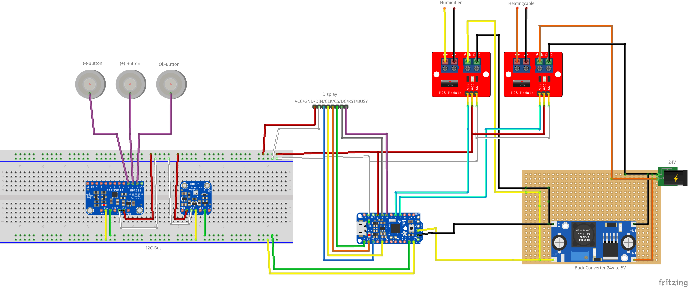

**Circuit diagram:**

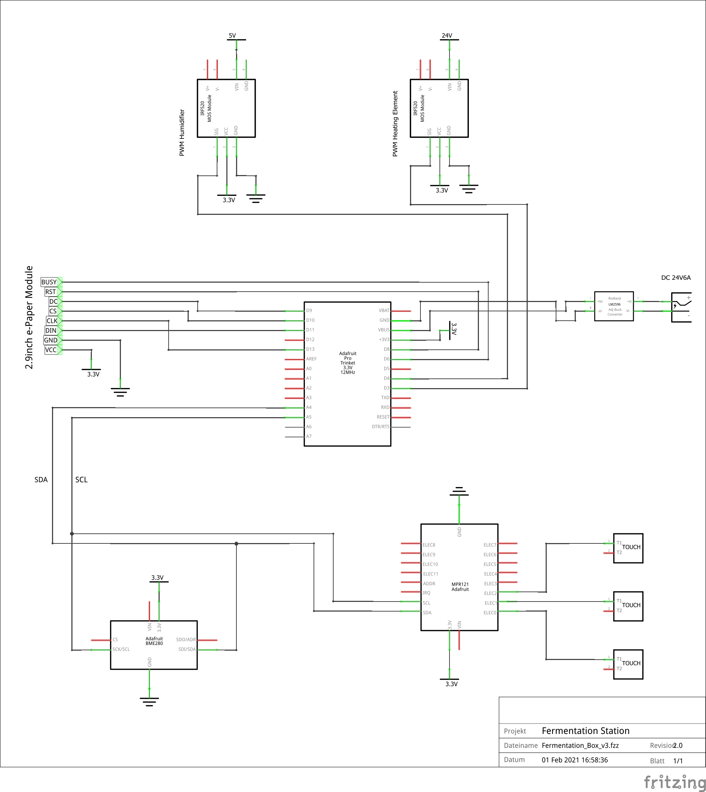

### Testing the individual components

Before putting everything together we recommend testing the individual parts separately. During our build we encountered problems especially with the e-Ink display. Checking the bought hardware early will prevent unnecessary delays later on. 

The chosen components come all with example code from the manufacturers or distributors like Adafruit. All the examples can be built and run with the Arduino IDE.

- **Waveshare e-Ink Display: [GitHub](https://github.com/waveshare/e-Paper)**
    - Run the demo code in */Arduino/epd2in9/epd2in9.ino*
    - If the TrinketPro is used for testing, change the BUSY pin defined in /Arduino/epd2in9/epdif.h from 7 to 6. (Pin 7 on the TrinketPro isn't exposed and reserved for the onboard USB connection)
- **BME280: [Adafruit](https://learn.adafruit.com/adafruit-bme280-humidity-barometric-pressure-temperature-sensor-breakout/arduino-test)**
    - On the linked website you find a detailed explanation on how to add and run the example code in the Arduino IDE for the BME280-Sensor.
- **MPR121: [Adafruit](https://learn.adafruit.com/adafruit-mpr121-12-key-capacitive-touch-sensor-breakout-tutorial?view=all)**
    - Same goes for the touch sensor. Add the example code to the IDE and test the touch sensor.
    - After testing the touch sensor we recommend switching to bigger electrodes. This makes controlling and testing the fermentation station easier. We used simple [copper foil](https://www.conrad.de/de/p/pb-fastener-kupferfolie-selbstklebend-l-x-b-150-mm-x-30-mm-inhalt-10-st-529532.html) to build our electrodes.

After testing the individual components they can be combined according to our schematics.

After development, we tried to go for a more permanent setup. We replaced the breadboard with a perfboard. Instead of soldering our microcontroller and sensors directly onto the perfboard we used pin headers, so the modules can be easily attached or removed if we want to reuse them for other projects. Since it was our first attempt at soldering a permanent prototype the result isn't perfect, but it does the job.

To prevent damage to the hardware components and wiring we 3D-printed a simple case for our prototype. We added a cutout in the top of the box for the display. The electrodes were placed inside the box. The electrodes can reliably detect touch input through the plastic - No buttons needed!

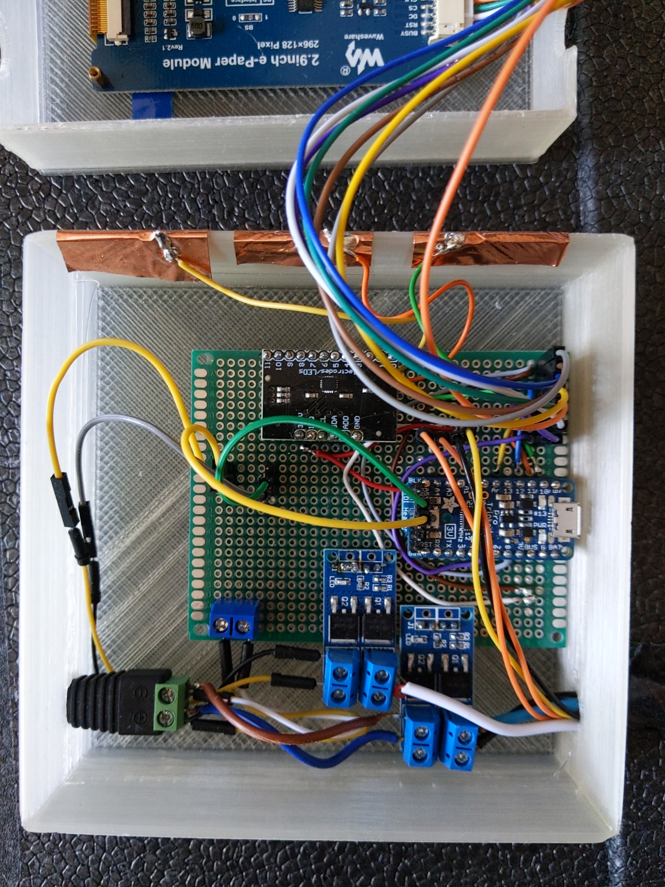

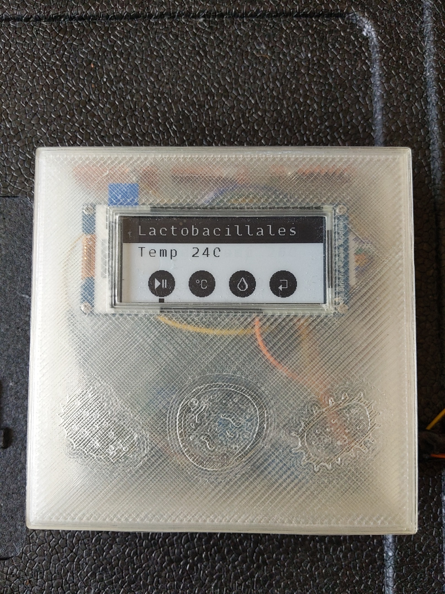

## Software

The project is written in embedded C, no external libraries are used. Additionally, for font rendering we use Python to create the individual character bitmaps.

### Building and Flashing

To be able to build and flash the firmware onto the microcontroller, you need to have `[avr-gcc](https://www.google.com/search?client=safari&rls=en&q=avrgcc&ie=UTF-8&oe=UTF-8)` and `avrdude` installed. On Windows, `[WinAVR](http://winavr.sourceforge.net)` can be used as an alternative to `avr-gcc`. 

The build process is handled via a Makefile. In order to get started with building, simply execute the following commands in the root folder of the repository.

```bash
> cd <repo-dir>
> mkdir build
> make clean
> make build
> make flash
```

`make clean` sets us up with a bland slate, deleting all files created in the build process. This also forces a complete rebuild.

`make build` bundles all the code into a format that can be flashed onto the microcontroller.

`make flash` flashes the previously build .hex file onto the microcontroller. This also executes `build` beforehand.

## Implementation Details

### Design Principles

- Rely on CI/CD for catching breaking changes early
- Clang format for enforced coding styles
- As functional as possible - no faked Classes in C!
- Work with git and feature branches

### Architecture

Our architecture consists of a hardware interface layer, a driver layer, a controller layer and the main program flow which is implemented as a state machine. We have split the code in modules beginning from the components that communicate directly with the hardware up to the high-level functions that we use to control the sensors & actors. This keeps the code well-arranged. 

- The Hardware Interfaces Layer represents the low-level protocols that we implemented. In our project SPI is used to communicate with the display, UART for writing to the display and I2C for retrieving sensor information from the temperature/humdity sensor and the touch sensor.
- The Drivers Layer contains an API that our controller layer can use to execute functions that work on the different hardware components.
- The Controller Layer provides high-level functions to interact with the different hardware and sensors. An example is the Renderer that can write text and images onto the display. Some example functions and more implementation details on the Renderer are shown in chapter Font and Image Rendering
- The state machine, which is explained in detail in the following chapter, is used to control the program flow. Additionally, it writes errors that occur to the Serial Port (using our Logging controller).

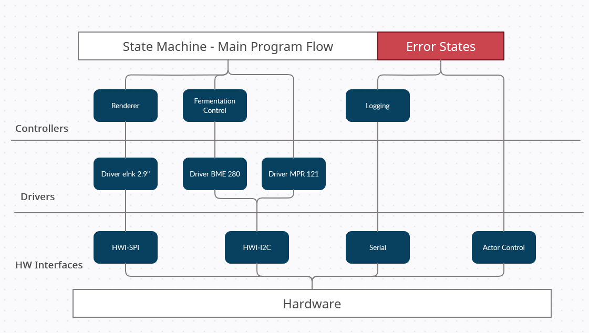

### State Machine

For controlling the main program flow we used a state machine. The state machine helps us to permanently query the touch sensor for user input. If the touch sensor receives any input it writes to an input register which in turn gets requested by the main program flow. If a state change occurs the state machine triggers the Font and Image Rendering process to update the display.

The following graphic visualizes the main program flow handled by our state machine. On start, the program displays the Recipe Selection menu. Once the user has selected a recipe the state machine switches to the Fermentation Process. The user can then access the sub-menus for Temperature Change or Humidity Change or may end the Fermentation Process and return to the Recipe Selection.

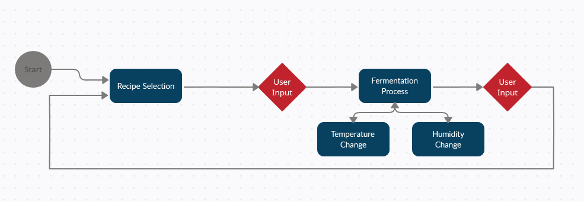

### PID Controller

To keep our temperature steady we decided to implement a PID controller. A PID (proportional-integral-derivative) controller is a control loop that uses error calculations and three basic mathematic formulas to achieve a constant convergence towards our desired temperature or humidity value.

The values to control how the controller operates are called *control terms* and have to be determined by experimentation. To achieve this, we conducted several test fermentations to determine the *control terms* and optimized them towards values that work for our use-case.

With this implementation we now have a mechanism that controls the power supply for our heat cable and nebulizer so that heat and humidity reach the desired values and maintain them at a steady level.

The following graphic is a plot of the actual temperature and our desired temperature in an example fermentation process. In this example the controller regulates the temperature to around 1°C around the desired value of 29°C.

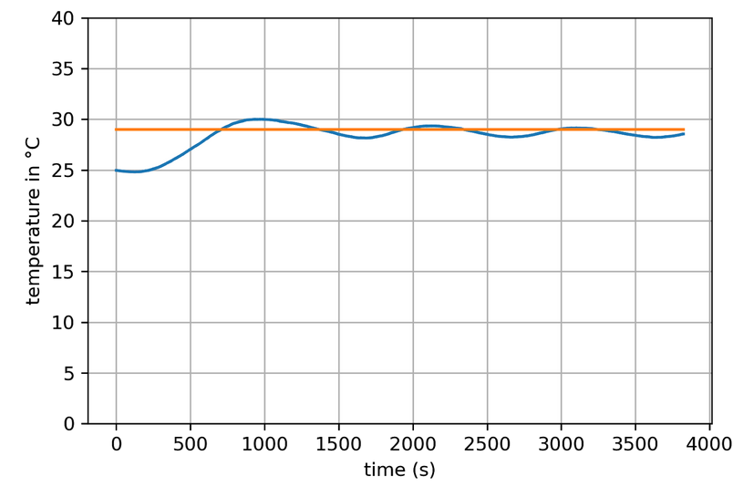

### Font and Image Rendering

We use a Waveshare 2.9" black and white e-Ink Display as our main method of providing feedback to the user. This is done by showing information like the currently selected recipe, as well as the current temperature and humidity.

Images and text are written to the display as bitmaps, which ,due to the type of controller used on the display, needs to adhere to multiples of 8, as it doesn't support bitwise updates of the frame memory.

Both images and text were prepared with python. The font was rendered out using the Pillow Image library and exported as a series of hex arrays. The images received the same treatment. All steps required for turning a font into a usable bitmap can be seen in the provided jupyter notebook, `font_rendering.ipynb`.

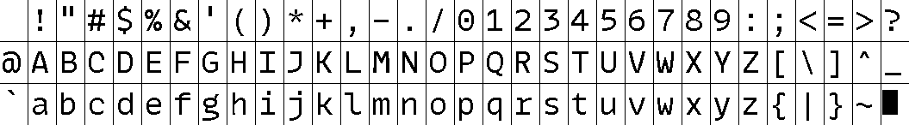

An example of what the rendered font looks like

The process of getting elements to render on the display is fairly complex and very specific to this controller. Also, the display is intended to be used narrow side up, so the indexing of the display memory didn't translate well to our intended use of placing the display wide side up. In order to have an easier interaction with the display, we implemented an additional layer of utility functions on top of the underlying rendering methods. Thus, after the renderer was completed we only needed to use the following functions:

```c
void print_text(const char* string, int x, int y, int white_on_black);
void show_image(const unsigned char* image_buffer, int x, int y, int width, int height, int invert);
void draw_box(int color, int x, int y, int width, int height);
void display_wipe(void);
void display_render_frame(void);
```

One of the main things to keep in mind about the display is that it manages two different frame memory areas. This is due to historic reasons and isn't really justified today whatsoever - but it kept the price for the eInk display low. Basically, the display alternates between these two areas when deciding what to actually put on the display. This requires for different approaches when updating the display depending on the purpose of the update.

**Purpose 1**: Updating a fixed element on the screen. In order to have all elements not flicker around, they need to be written and rendered twice.

**Purpose 2**: In case of elements that are updated every step, it's enough to write it once. This saves a bit of time because we don't have to render everything twice.

# Outlook

We couldn't test yet how the software behaves if it runs for an extended period (some fermentation recipes have to run for 6 months). So this is definitely something that has to be tested. 

Also, we are not entirely happy with the performance of the Renderer. Sometimes the rendering process takes a bit longer than we would like it to. So we want to make some performance optimisations to the Renderer and the State Machine.

As the cherry on top we would like to design our own PCB with all the necessary components on it, as well as some fancy capacitive touch buttons etched into its surface. While we have all the functionality we want integrated into our fermentation station, the presentation is still a bit lacking - but nothing that a bit of eye candy cannot fix.